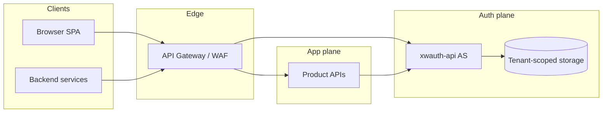
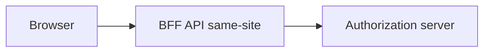
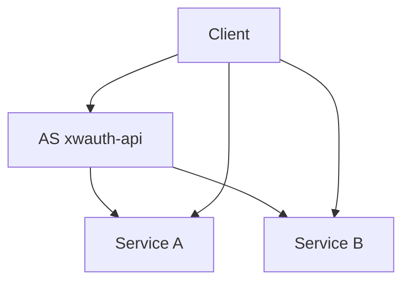
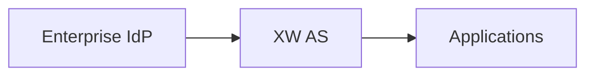
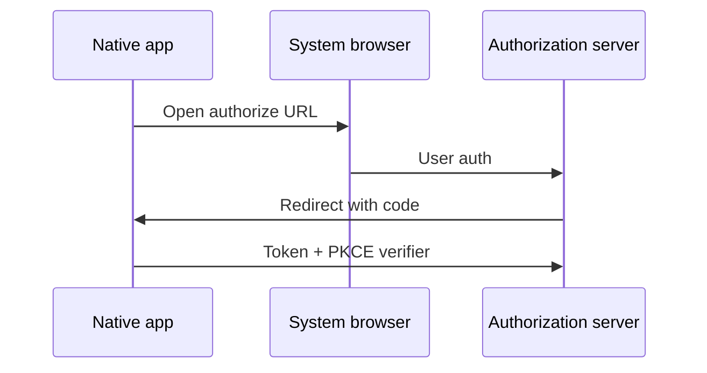

# GUIDE_04 — Reference architecture diagrams

**Purpose:** End-to-end **placement** diagrams for common deployment shapes using the XW auth stack.  
**Roadmap:** [.references/ROADMAP_SCORE_20.md](../.references/ROADMAP_SCORE_20.md) item **#20**.  
**Not** performance benchmarks — see [../benchmarks/README.md](../benchmarks/README.md).

---

## 1. B2B SaaS (org-bound tokens)

Organizations are represented in **token claims** or **path-scoped APIs**; the AS issues tokens with org context. Tenancy helpers live in **xwsystem** (`tenancy` module). See [REF_37_MULTI_TENANT_REFERENCE_STACK.md](REF_37_MULTI_TENANT_REFERENCE_STACK.md).

---

## 2. SPA with BFF (recommended for browser)

The **browser** talks to a **same-origin BFF**; the BFF performs OAuth/OIDC with the AS using **server-side** client credentials or PKCE as appropriate. Reduces token exposure compared to public client-only SPAs calling the AS directly.

---

## 3. Microservices with central AS

Multiple resource servers validate JWTs (JWKS or shared validation) and call **introspection** when tokens are opaque.

---

## 4. Enterprise bridge (federation sketch)

Upstream **IdP** (SAML/OIDC) federates into the connector; your AS remains the **relying party** for applications. Details vary by IdP — see [REF_27_IDP_OIDC_QUIRKS.md](REF_27_IDP_OIDC_QUIRKS.md).

---

## 5. Mobile / native public client

Native app uses **system browser** or **ASWebAuthenticationSession** / Custom Tabs; **PKCE** required for public clients (enforced in connector profiles).

---

## Related

- Edge integration: [REF_33_PARTNER_INTEGRATION_MATRIX.md](REF_33_PARTNER_INTEGRATION_MATRIX.md)  
- Ops: [REF_63_AUTH_OBSERVABILITY_CONTRACT.md](REF_63_AUTH_OBSERVABILITY_CONTRACT.md)
